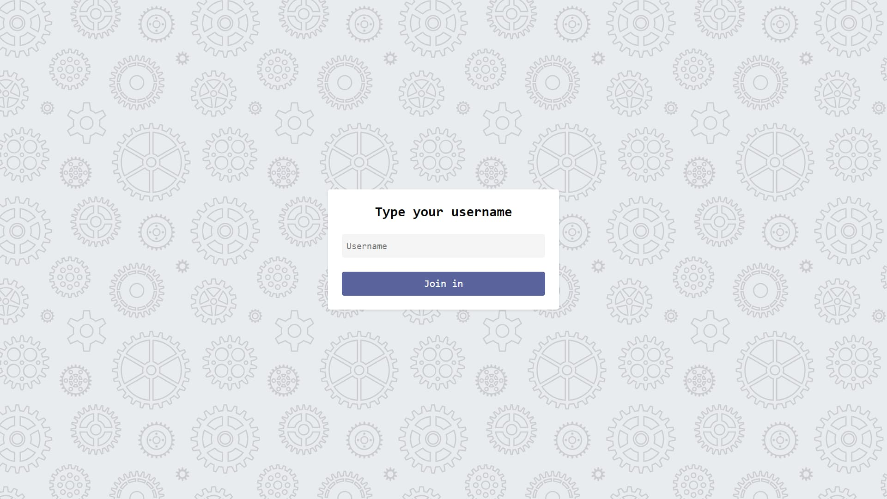
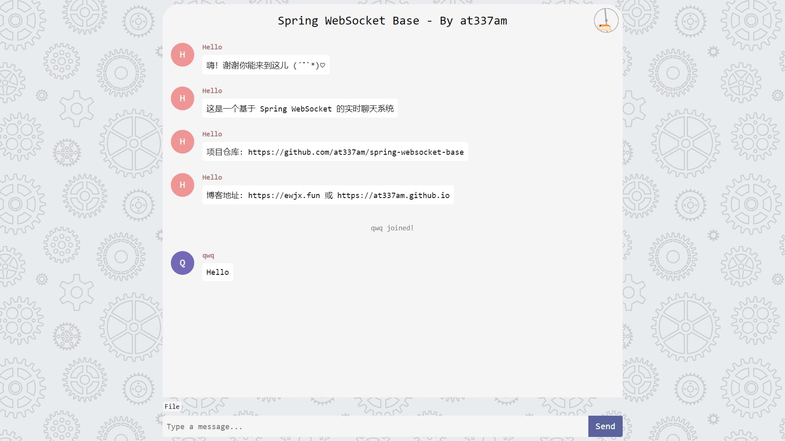

## Overview

This project is a real-time chat system based on Spring Boot, WebSocket, and MongoDB, for learning reference only.

view1:



view2:



### Required Software Versions

1. **Java Development Kit (JDK)**: Version 21
2. **Apache Maven**: Version 3.6.0 or higher
3. **Spring Boot**: Version 3.2.6
4. **MongoDB**: Version 4.0 or higher
5. **Docker**: Version 20.10.0 or higher (includes Docker Compose)

#### 1. Clone the Repository and Navigate to the Directory

First, clone the project repository from GitHub. Use the following commands to clone the repository to your local machine and navigate into the project directory:

```bash
git clone https://github.com/at337am/spring-websocket-base.git
cd spring-websocket-base
```

#### 2. Configure and Start MongoDB Container

Modify the `docker-compose.yml` file in the project root directory to ensure the MongoDB container is properly configured:

```bash
services:
  mongodb:
    image: mongo
    container_name: mongo_db
    ports:
      - "27017:27017"
    volumes:
      - mongo:/data
      - ./tmp:/tmp
    environment:
      - MONGO_INITDB_ROOT_USERNAME=root
      - MONGO_INITDB_ROOT_PASSWORD=root
volumes:
  mongo: {}
```

Start the MongoDB container using the following command:

```bash
sudo docker compose up -d
```

#### 3. Configure Application Port and Database Information

Modify the `application.yml` file in the project root directory to set up the application's port and MongoDB database information:

```bash
server:
  port: 80

spring:
  servlet:
    multipart:
      max-file-size: 16MB
      max-request-size: 160MB
  data:
    mongodb:
      host: localhost
      port: 27017
      database: webSocket_base
      username: root
      password: root
      authentication-database: admin
```

#### 4. Install Dependencies and Run the Application

Ensure Maven 3.6.0 or higher is installed. Run the following commands in the project root directory to install dependencies and start the application:

```bash
mvn install
mvn spring-boot:run
```

Alternatively, package the application into a jar file and run it:

```bash
mvn package
java -jar target/your-application.jar
```

Replace `your-application.jar` with the actual name of the generated jar file.

#### 5. Access the Application

Finally, open your web browser and enter `localhost` to access your web application.
